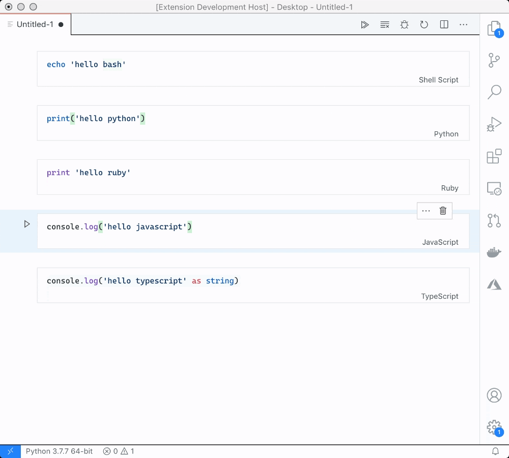

#  Handy Dandy Notebook - VS Code

Execute cells in bash, JavaScript, TypeScript, Ruby, or Python.

Provides the command: `New Handy Dandy Notebook` to open a new untitled notebook. Also opens `.hdnb` files by default, and opens `.md` files via the `View: Reopen Editor With...` option.

